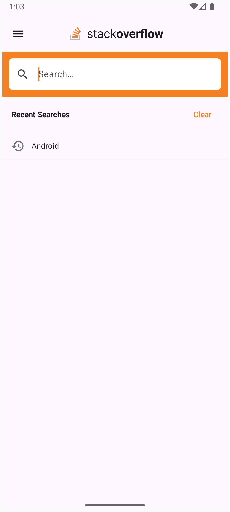
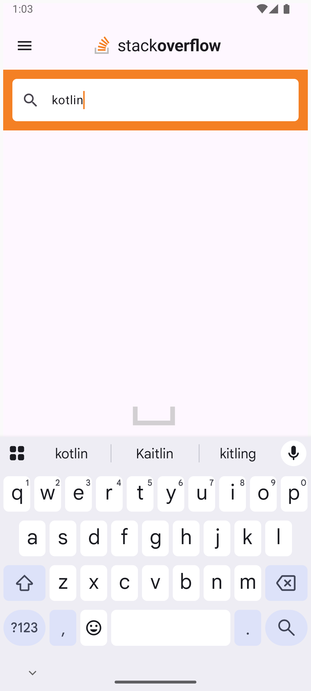
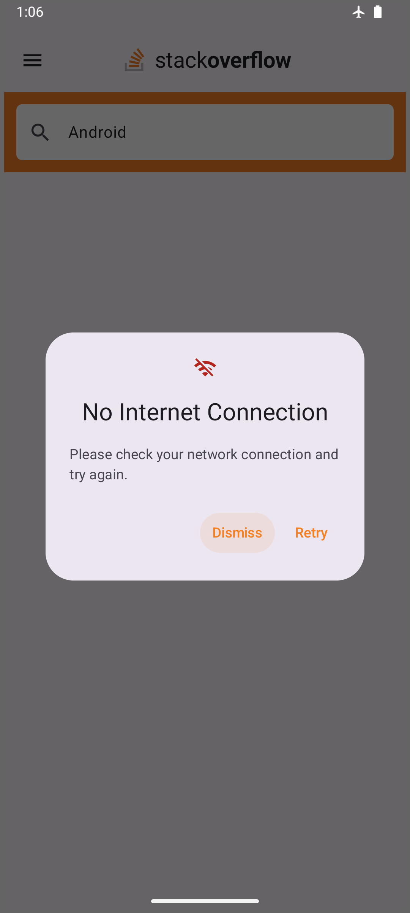
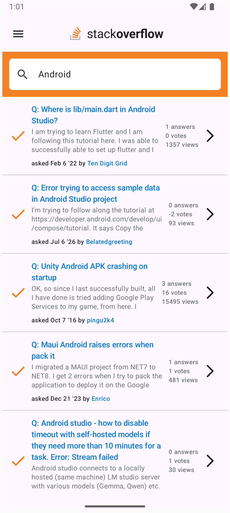
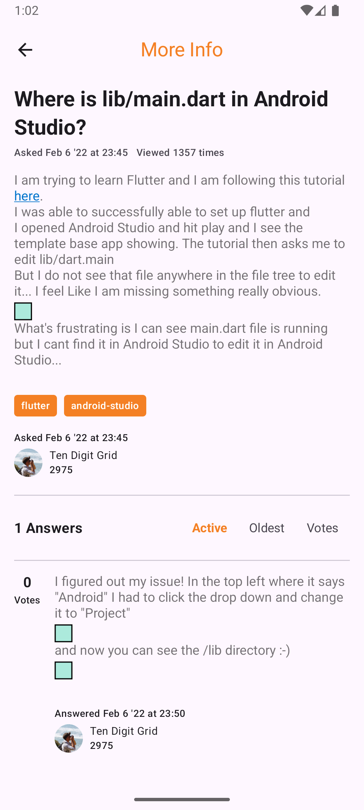

# StackOverflow Search

An Android app for searching Stack Overflow questions and viewing their full detail (question body + all answers), built against the public [StackExchange API](https://api.stackexchange.com/docs).

## Screenshots

| Search — empty state / recent searches | Search — loading | Search — no connection |
| --- | --- | --- |
|  |  |  |

| Search — results | Detail |
| --- | --- |
|  |  |

## Architecture

The app is split into Gradle modules, layered by responsibility rather than a strict Clean Architecture domain/data split — small enough to stay simple, but structured enough to keep concerns separated and each piece independently testable.

```
:app                    Composition root — Application/Activity, NavHost, DI wiring
:core:network           Data layer — API, DTOs, repositories, connectivity, DataStore
:core:ui                Design system — theme, shared composables (loading, error, no-network dialog)
:feature:search          Search screen — ViewModel + Compose UI
:feature:detail          Detail screen — ViewModel + Compose UI
```

Dependency direction is one-way: both feature modules depend on `:core:network` and `:core:ui`; `:app` wires everything together and is the only module that depends on all of them. `:core:network` and `:core:ui` have no dependencies on each other or on any feature module.

**Pattern: MVVM.** Each screen has a `ViewModel` (`SearchViewModel`, `DetailViewModel`) exposing a single `StateFlow<UiState>` consumed by a stateless `@Composable` screen. UI state is modeled as a sealed interface per screen (`SearchUiState`, `DetailUiState`) with explicit `Idle` / `Loading` / `Success` / `Error` / `NoNetwork` variants, so the Compose UI is a straightforward `when` over the current state rather than juggling booleans/nullables.

**Data flow:**
- `StackExchangeApi` (Retrofit) hits `search/advanced` and `questions/{id}/answers`, both with `filter=withbody` so the full question/answer HTML comes back in one call.
- DTOs are mapped to plain domain models (`Question`, `Answer`) before reaching the UI layer — the UI never sees the wire format.
- `StackOverflowRepositoryImpl` also caches the last search results in memory, keyed by question id, so opening a question's detail screen doesn't need a third network call — the question itself is already available, and only its answers are fetched.
- `NetworkMonitor` wraps `ConnectivityManager` as a `StateFlow<Boolean>`. Each ViewModel checks it before making a request *and* treats any `IOException` from a request as a connectivity failure, so a dropped connection mid-request surfaces the same `NoNetwork` state as being offline up front — including a check at app launch, before any search is performed.
- Recent searches are persisted locally via `RecentSearchesRepository` (Preferences DataStore), shown on the search screen's empty state, independent of network access.

**Dependency injection:** Hilt throughout — `@HiltViewModel` for both ViewModels, constructor injection for repositories/monitors, `@Binds` modules in `:core:network` for the interface → implementation wiring.

**Requirements from the brief:** portrait-only (locked in the manifest), scales across device sizes (Compose + `dp`/`sp` units, no fixed layouts), network errors and connectivity are explicitly handled with a custom dialog (not a generic toast/crash).

## Libraries used

| Library | Purpose |
| --- | --- |
| [Jetpack Compose](https://developer.android.com/jetpack/compose) + Material 3 | UI toolkit |
| [Navigation Compose](https://developer.android.com/jetpack/androidx/releases/navigation) | Search → Detail navigation |
| [Hilt](https://dagger.dev/hilt/) | Dependency injection |
| [Retrofit](https://square.github.io/retrofit/) + [OkHttp](https://square.github.io/okhttp/) | HTTP client / API layer |
| [kotlinx.serialization](https://github.com/Kotlin/kotlinx.serialization) | JSON (de)serialization, via the Retrofit kotlinx-serialization converter |
| [kotlinx.coroutines](https://github.com/Kotlin/kotlinx.coroutines) | Async work, `Flow`/`StateFlow` |
| [Coil 3](https://coil-kt.github.io/coil/) | Image loading (answer/question owner avatars) |
| [DataStore (Preferences)](https://developer.android.com/topic/libraries/architecture/datastore) | Persisting recent searches |
| [MockK](https://mockk.io/) + [Turbine](https://github.com/cashapp/turbine) + `kotlinx-coroutines-test` | ViewModel unit tests |

## Requirements

- Android Studio with AGP 8.11+
- JDK 17+ (or use Android Studio's bundled JBR)
- minSdk 24, compileSdk/targetSdk 36

## Building

```
./gradlew :app:assembleDebug
```

## Running tests

```
./gradlew :feature:search:testDebugUnitTest :feature:detail:testDebugUnitTest
```
